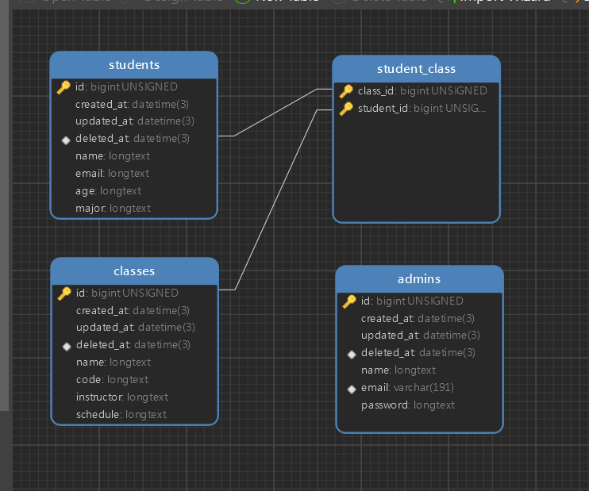

# Learning Management System (LMS) API Flow Camp ID

## 📌 Project Overview

LMS API Flow Camp ID adalah sistem manajemen pembelajaran berbasis API yang dikembangkan menggunakan **Golang (GORM)** dan **MySQL**. API ini mencakup beberapa fitu yaitu manajemen kelas, manajemen siswa, manajemen admin, login, register, serta menambah dan menghapus siswa dari kelas.

---

## 🚀 Cara Menjalankan Proyek

### **1. Clone Repository**

```sh
https://github.com/MuhammadYusrilAmin/mastering-golang.git
cd mastering-golang/restfulapi/muhammad-yusril-amin
```

### **2. Install Dependencies**

```sh
go mod tidy
```

### **3. Konfigurasi Database**

Buat file `.env` berdasarkan template berikut:

```env
DB_HOST=localhost
DB_PORT=3306
DB_USER=root
DB_PASSWORD=
DB_NAME=your_database_name

JWT_SECRET_KEY=your_secret_key
JWT_EXPIRES_IN=24h

```

### **4. Menjalankan Server**

```sh
go run main.go
```

API akan berjalan di `http://localhost:8000`

---


## 📜 API Documentation & Testing

Berikut adalah langkah-langkah untuk melakukan testing:

- **Buka Postman.**
- **Klik Import → Pilih file:** `docs/API LMS.postman_collection.json`
- **Semua endpoint akan tersedia untuk testing.**

---

## 📌 Database Design

Berikut adalah desain database untuk proyek ini:



## 📌 Teknologi yang Digunakan

- **Go (Golang) + GORM** - Backend & ORM
- **MySQL** - Database
- **Gin** - Framework API Golang
- **JWT** - Autentikasi
- **Godotenv** - Mengelola variabel lingkungan dari .env

---
